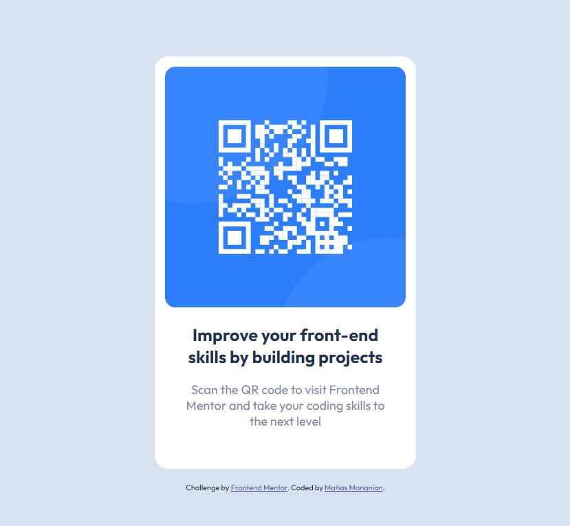

# Frontend Mentor - QR code component solution

This is a solution to the [QR code component challenge on Frontend Mentor](https://www.frontendmentor.io/challenges/qr-code-component-iux_sIO_H). Frontend Mentor challenges help you improve your coding skills by building realistic projects. 

### Screenshot

### Built with

- Semantic HTML5 markup
- CSS custom properties

## Author

- Website - [Matias Mananian] (https://www.matiasmananian.com.ar)
- Linkedin - [Matias Mananian] (https://www.linkedin.com/in/matias-mananian-68740515/)
- Twitter - [@elmatu2012] (https://www.twitter.com/elmatu2012)
